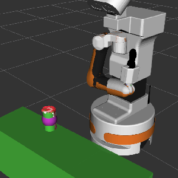
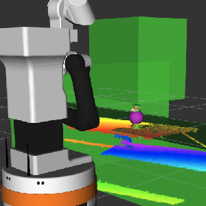
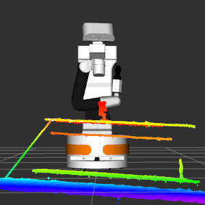

# Grasping Package

This is the new grasping package, completely different from the one used last semester. It is implemented entirely with Python scripts.

## File Structure

    grasping/
    ├── launch/
    |   └── add_objects.launch
    ├── scripts/
    |   ├── grasp.py
    |   ├── insert_grasp_object.py
    |   ├── planning_grasp.py
    |   └──  table_collision_publisher.py
    └── README.md

## Key features

- `grasp.py`: Executes the grasping procedure.

- `insert_grasp_object.py`: Supports shape completion and center point estimation based on object point clouds to enable more accurate grasping. Additionally, it inserts surrounding virtual obstacles to force the arm to follow a desired approach path.

- `table_collision_publisher.py`: Adds the table as a collision object to `Planning Scene` of `MoveIt`to prevent the collision.

- `planning_grasp.py`: Attempts to grasp the target object in the `Planning Scene`of `MoveIt`. The current implementation is still under development and needs further improvement.

## Usage

This package must be used together with `plane_segmentation` and `object_labeling` nodes.

    roslaunch grasping add_object.launch

    rosrun grasping grasp.py

## Example

🟣 The purple sphere indicates the center of the completed object shape.

🟢 The green part shows the obstacles added to the `Planning Scene`.

## TODO

- 力反馈

- **Multi-object grasping**: Enable multi-object detection and grasping, potentially by integrating the `SAM` or `YOLOv8-segmentation` model. Use the segmentation mask to project onto the point cloud and select the desired grasp target.

- **Improve end-effector orientation**: Currently, the end-effector always faces the positive x-axis during grasping. To improve flexibility and reduce trajectory limitations, the orientation should dynamically face the object to enable grasping from multiple angles.

- **Fix MoveIt Cartesian Path Planning**: The current Docker image has version mismatches in MoveIt, leading to `compute_cartesian_path()` failures. Resolving this will significantly improve grasp predictability.

- **Robot pose adjustment**: Estimate the straight-line distance from the object to Tiago's `base_link`, then reposition the robot to maintain optimal grasping distance and orientation.

- **TF misalignment issue**: Due to TF inaccuracies, the point cloud appears tilted. Fix TF frames or introducing compensation.

