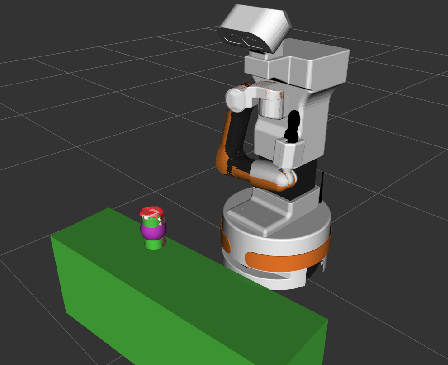

# New Grasping Package

This is the new grasping package, completely different from the one used last semester. It is implemented entirely with Python scripts.

The code is thoroughly commented for reference.

## Key features

- `grasp.py`: Executes the grasping procedure.

- `insert_grasp_object.py`: Supports shape completion and center point estimation based on object point clouds to enable more accurate grasping.

- `table_collision_publisher.py`: Adds the table as a collision object to `Planning Scene` of `MoveIt`to prevent the collision.

- `planning_grasp.py`: Attempts to add the target object to the `Planning Scene`of `MoveIt`. The current implementation is still under development and needs further improvement.

## Example

🔴 The red points represent the point cloud of the cola can.

🟢 The green part shows the object added to the `Planning Scene`.

🟣 The purple sphere indicates the center of the completed object shape.

## Usage

    roslaunch grasping add_object.launch

    rosrun grasping grasp.py

## File Structure

    grasping/
    ├── launch/
    |   └── add_objects.launch
    ├── scripts/
    |   ├── grasp.py
    |   ├── insert_grasp_object.py
    |   ├── planning_grasp.py
    |   └──  table_collision_publisher.py
    └── README.md

## TODO

- Enable multi-object detection and grasping, potentially by integrating the `YOLOv8-segmentation` model. Use the segmentation mask to project onto the point cloud and select the desired grasp target.

- Improve `planning_grasp.py` for more reliable object insertion into the Planning Scene.

- Estimate the straight-line distance between the object and the Tiago's `base_link`, then move the robot to an appropriate distance and orient it to face the object.
*Low priority, as the current grasping pipeline is already sufficiently robust.*
